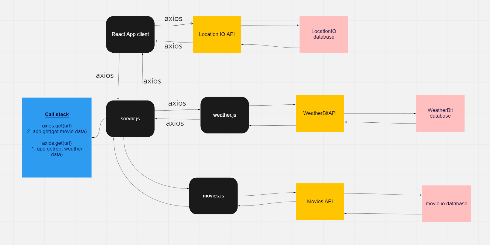

# City Explorer API

**Author**: Luis Sandoval
**Version**: 1.0.3

## Overview
<!-- Provide a high level overview of what this application is and why you are building it, beyond the fact that it's an assignment for this class. (i.e. What's your problem domain?) -->
This server allows the user to access location, weather, and movie data based on their input. The server requests the data from WeatherBit and MovieDB. This server is hosted on Heroku.

## Getting Started
<!-- What are the steps that a user must take in order to build this app on their own machine and get it running? -->
Modularize the back-end code base.

## Architecture
<!-- Provide a detailed description of the application design. What technologies (languages, libraries, etc) you're using, and any other relevant design information. -->
- ExpressJS

## Change Log
<!-- Use this area to document the iterative changes made to your application as each feature is successfully implemented. Use time stamps. Here's an example:

01-01-2001 4:59pm - Application now has a fully-functional express server, with a GET route for the location resource. -->

## Credit and Collaborations
<!-- Give credit (and a link) to other people or resources that helped you build this application. -->

- Derek Douglas

- Zayah Lang

- Jim Doyle

- Martha Quintanilla-Ramirez

- Natalija Germek

- Tanesha

Name of feature: City Explorer API lab 09/ Refactoring into Modules

Estimate of time needed to complete: 2.5 hours

Start time: 12:00

Finish time: 2:15

Actual time needed to complete: 2.25 hours
